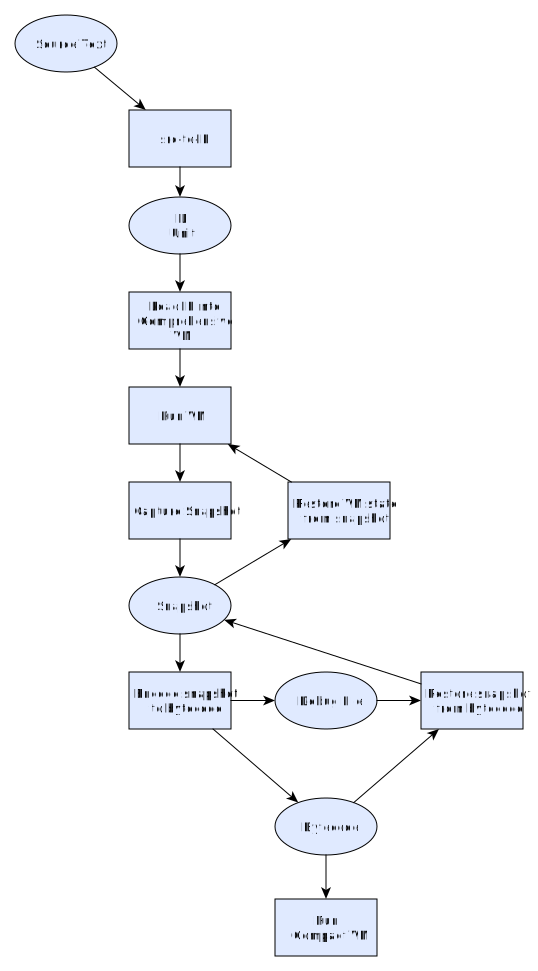

# Contributing

Contact me, [Mike](mailto:mike@coder-mike.com), if you want to join the development team.

## Development Workflow

A suggested pre-commit git hook is as follows:

```sh
#!/bin/sh
set -e
npm run check-for-wip
npm test
```

Then if you have anything you need to remember to change before committing, put a `// WIP` comment on it, and the hook will catch it if you accidentally forget about it.

## To Do

### Milestone 1: End-to-End

The first milestone will be getting some code through the whole pipeline. This implementation will be deep rather than wide -- at least one case must work end-to-end, but there need not be many supported cases.



### Later Milestones

Following the first milestone, most work will be to flesh out the implementation to be wider (e.g. more opcodes supported, etc).

Other major components that need to be implemented:

 - A debugger
