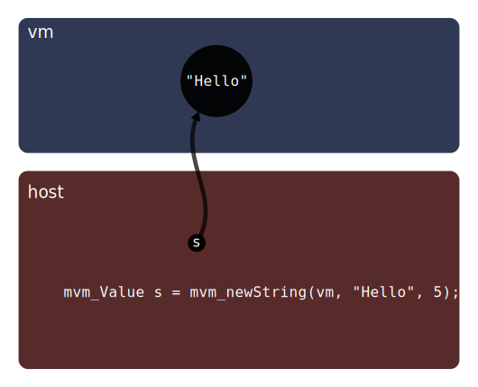
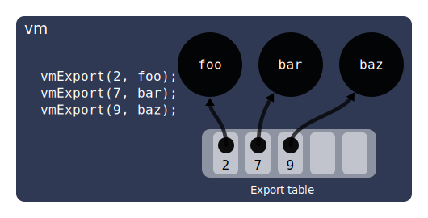

# Guide to interfacing between JS and C

This guide discusses the interface between a Microvium VM (JavaScript app) and a C host without the use of any FFI wrapper library.


## mvm_Value

The `mvm_Value` type in the host represents a reference to a JavaScript value in the VM, such a number, string, or function.

In the following diagram, the JavaScript string "Hello" exists in the virtual machine heap and the host variable `s` refers to it.



The host can get an `mvm_Value` in a variety of ways, one of which calling API functions like `mvm_newString`, as in the above example.


## Handles

An `mvmValue` should typically be wrapped in a *handle* (`mvm_Handle`), which prevents the Microvium garbage collector from collecting the value. For example, if you allocate a new string in the VM, you may want to use the handle as follows:

```c
mvm_Handle myHandle;
mvm_initializeHandle(vm, &myHandle);
mvm_handleSet(&myHandle, mvm_newString(vm, "Hello", 5));
// ...
mvm_releaseHandle(vm, &myHandle);
```

The function `mvm_initializeHandle` adds the handle to a linked list of handles visible by the VM, and it will traverse the linked list during a garbage collection cycle as part of its reachability analysis and to update the `mvm_Value` if the allocation has moved to a different address.

There are times when a handle is not needed, but it's always safe to use a handle just-in-case.

See [handles-and-garbage-collection.md](handles-and-garbage-collection.md) for more details.


## Creating JavaScript values in the host

The host can create a new JavaScript value using one of these FFI functions:

- `mvm_newNumber`
- `mvm_newInt32`
- `mvm_newBoolean`
- `mvm_newString`
- `mvm_uint8ArrayFromBytes`

Note: `mvm_newInt32` is more efficient than `mvm_newNumber` if you are creating a number from a signed 32-bit integer. Also, `mvm_newInt32` is available even when float support is disabled in the port file (`MVM_SUPPORT_FLOAT`).


## Reading the contents of JavaScript values

When you have an `mvm_Value`, you can read its contents using one of these Microvium API functions:

- `mvm_toBool`
- `mvm_toInt32`
- `mvm_toFloat64`
- `mvm_toStringUtf8`
- `mvm_uint8ArrayToBytes`
- `mvm_typeOf`
- `mvm_isNaN`


## Exporting JS functions from the VM

The builtin JavaScript function `vmExport` can be called at build time to register a JavaScript function in the VM's export table, associating it with any numeric ID in the range 0 to 65535. Note: to understand the concept of build-time execution and snapshotting, see [concepts.md](./concepts.md).

```js
// script.js

function foo(a, b) { return a + b }
function bar() {}
function baz() {}

vmExport(2, foo); // Export with ID 2
vmExport(7, bar); // Export with ID 7
vmExport(9, baz); // Export with ID 9
```



The export table is part of the snapshot bytecode. The Microvium API function `mvm_resolveExports` can then be used in C to read the export table.

```c
#define EXPORT_COUNT

mvm_TeError err;

mvm_VMExportID ids[EXPORT_COUNT] = { 2, 7, 9 };
mvm_Value values[EXPORT_COUNT];
err = mvm_resolveExports(vm, &ids, &values, EXPORT_COUNT);
if (err != MVM_E_SUCCESS) abort();

mvm_Value foo = values[0]; // From ID 2
mvm_Value bar = values[1]; // From ID 7
mvm_Value baz = values[2]; // From ID 9
```

Note: the above example exports top-level functions, but you can equally export closures and arrow functions.


## Calling JavaScript functions

Once you have an `mvm_Value` that represents a function, you can call it using `mvm_call`. Let's say for example that we want to call `foo` from the above example, with two string arguments "Hello" and "World":

```c
// Initialize a
mvm_Handle a;
mvm_initializeHandle(vm, &a);
mvm_handleSet(&a, mvm_newString(vm, "Hello", 5));

// Initialize b
mvm_Handle b;
mvm_initializeHandle(vm, &b);
mvm_handleSet(&b, mvm_newString(vm, "World", 5));

// A handle for the result
mvm_Handle c;
mvm_initializeHandle(vm, &c);

// Call foo
mvm_Value args[2];
args[0] = mvm_handleGet(&a);
args[1] = mvm_handleGet(&b);
int argCount = sizeof args / sizeof args[0];
err = mvm_call(vm, foo, mvm_handleAt(&c), args, argCount);
if (err != MVM_E_SUCCESS) abort();

printf("%s\n", mvm_toStringUtf8(vm, mvm_handleGet(&c), NULL)); // HelloWorld

// Release values when we don't need them anymore. It's most efficient
// to release them in the reverse order they were initialized.
mvm_releaseHandle(vm, &c);
mvm_releaseHandle(vm, &b);
mvm_releaseHandle(vm, &a);
```

Note: when calling `mvm_newString` for `b`, Microvium is allowed to run the garbage collector. The value `a` here is safe in that case because we're using a handle for it.

Note: You can consider using a glue-code generator library to reduce some of the boilerplate required. If you're using C++, such a library can make the above example as short as a single line:

```c++
string c = app->foo("Hello", "World");
```

This will be discussed more in the "Advanced" section of this document.


## Importing C functions into the VM

Similar to `vmExport`, the builtin JavaScript function `vmImport` can be called at build time JavaScript to access C functions at runtime. Let's say for example that we have a C functions `add` and `print` which we want to call from JavaScript:

```c
int add(int a, int b) {
  return a + b;
}
void print(char* s) {
  printf("%s\n", s);
}
```

We can expose these functions to the VM through some glue code, but first let's look at the JavaScript side:

```js
const add = vmImport(3);
const print = vmImport(5);

function run() {
  const c = add(1, 2);
  print(c);
}

vmExport(1, run);
```

The above assumes that `add` will be exposed to the VM with ID `3`, and `print` with ID `5`. These can be any chosen integers in the range 0 to 65535. These can overlap with the IDs used for exports, since the export and import tables are completely independent.

I've also included a `run` function here to demonstrate how to actually call the imported functions.

The function `vmImport` registers the import in the import table of the VM, similarly to how `vmExport` registers the export in the export table. The import table is persisted in the snapshot, and will be used at runtime during `mvm_restore` to resolve all the imports to actual host values.

To expose `add` and `print` to the VM, we need to use some glue code:

```c
void main() {
  mvm_VM* vm;
  mvm_TeError err;

  // The key for this example is the &resolveImport argument.
  err = mvm_restore(&vm, &snapshot, snapshotSize, &resolveImport)
  if (err != MVM_E_SUCCESS) abort();
}

mvm_TeError resolveImport(mvm_HostFunctionID hostFunctionID, void* context, mvm_TfHostFunction* out_hostFunction) {
  // Note: you could use a table for this instead of conditions
  if (hostFunctionID == 3) *out_hostFunction = &add_glue;
  if (hostFunctionID == 5) *out_hostFunction = &print_glue;
  return MVM_E_FUNCTION_NOT_FOUND;
}

mvm_TeError add_glue(mvm_VM* vm, mvm_HostFunctionID hostFunctionID, mvm_Value* result, mvm_Value* args, uint8_t argCount) {
  if (argCount < 2) return MVM_E_UNEXPECTED;
  int a = mvm_toInt32(vm, args[0]);
  int b = mvm_toInt32(vm, args[1]);
  int c = add(a, b);
  *result = mvm_newInt32(vm, c);
  return MVM_E_SUCCESS;
}

mvm_TeError print_glue(mvm_VM* vm, mvm_HostFunctionID hostFunctionID, mvm_Value* result, mvm_Value* args, uint8_t argCount) {
  if (argCount < 1) return MVM_E_UNEXPECTED;

  // Copy string from JavaScript memory to C memory
  size_t len = mvm_stringSizeUtf8(vm, args[0]);
  char* s = malloc(len + 1); // Including null terminator
  strncpy(s, mvm_toStringUtf8(vm, args[0], NULL), len + 1);

  print(s);

  free(s);
  *result = mvm_undefined;
  return MVM_E_SUCCESS;
}
```

Note: the glue code for `print_glue` demonstrates how to copy the string out of the JavaScript heap and into the C heap. In this particular example, this is not necessary because the result of `mvm_toStringUtf8` can be directly passed to `print`. However, if we extended the example to have 2 string arguments instead of 1, then the second `mvm_toStringUtf8` has the potential to trigger a garbage collection cycle which is permitted to reclaim or move the memory pointed to by the first `mvm_toStringUtf8`. If in doubt, assume that memory in JavaScript-land may move or be reclaimed at any time.


## Objects and Arrays

The Microvium C API does not provide a built-in way to create or manipulate JavaScript objects and arrays, but you easily export your own functions to do so, for example:

```js
vmExport(1, () => ({})); // create object
vmExport(2, () => []); // create array
vmExport(3, (arr, i) => arr[i]); // get element of array or object
vmExport(4, (arr, i, v) => arr[i] = v); // set element of array or object
```


# Advanced

## C++ Handles and RAII

If you're using C++, you can avoid a lot of the boilerplate of managing handles by using the [RAII](https://en.wikipedia.org/wiki/Resource_acquisition_is_initialization) pattern to automatically initialize and release the handle as-needed.

```cpp
struct Value {
  // Constructor
  Value(mvm_VM* vm): _vm(vm) {
    mvm_initializeHandle(_vm, &_handle);
  }

  // Construct with value
  Value(mvm_VM* vm, mvm_Value value): _vm(vm) {
    mvm_initializeHandle(_vm, &_handle);
    mvm_handleSet(&_handle, value);
  }

  // Copy constructor
  Value(const Value& other): _vm(other._vm) {
    mvm_cloneHandle(_vm, &_handle, &other._handle);
  }

  // Destructor
  ~Value() { mvm_releaseHandle(_vm, &_handle); }

  // Get the value that the handle holds
  mvm_Value& value() const { return *mvm_handleAt(&_handle); }
private:
  mvm_VM* _vm;
  mvm_Handle _handle;
};
```

If we apply that to the example from earlier from the section [Calling JavaScript functions](#calling-javascript-functions), we can see that it becomes much more succinct:

```cpp
Value a(vm, mvm_newString(vm, "Hello", 5));
Value b(vm, mvm_newString(vm, "World", 5));
Value c;

// Call foo
mvm_Value args[2];
args[0] = a.value();
args[1] = b.value();
int argCount = sizeof args / sizeof args[0];
err = mvm_call(vm, foo, &c.value(), args, argCount);
if (err != MVM_E_SUCCESS) abort();

printf("%s\n", mvm_toStringUtf8(vm, c.value(), NULL)); // HelloWorld
```


## Dynamic Exports

You need not decide all the import and export IDs in advance. You can dynamically generate IDs as you need them, as in the following toy example:

```js
let nextExportID = 0;
function myExport(func) {
  const id = nextExportID++;
  vmExport(id, func);
}

myExport(foo); // ID 0
myExport(bar); // ID 1
myExport(baz); // ID 2
```

But then how do we get matching IDs on the host side? We can use the build-time execution in Microvium, combined with the build-time `fs` module, to code-generate the C IDs, as in the following example:

```js
import * as fs from 'fs';

let nextExportID = 0;
let cHeader = '#pragma once\n';

function myExport(name, func) {
  const id = nextExportID++;
  cHeader += `\n#define EXPORT_${name} ${id}`;
  vmExport(id, func);
}

myExport('foo', foo); // ID 0
myExport('bar', bar); // ID 1
myExport('baz', baz); // ID 2

fs.writeFileSync('my-export-ids.h', cHeader + '\n');
```

At build-time, this will code-generate the following C header file:

```c
#pragma once

#define EXPORT_foo 0
#define EXPORT_bar 1
#define EXPORT_baz 2
```

You can play with variations of this to suit your specific needs. If you need your IDs to remain stable across app versions, you can keep a built-time JSON file that keeps track of the previous associations.


## Code-generating FFI Glue Code

Not only can you code-generate `#define` IDs, but you can generate all the glue code, with something like the following example:

```js

let cFile = '';

function myExport(name, func, returnType, argTypes) {
  const id = nextExportID++;
  vmExport(id, func);

  cFile += `
    mvm_TeError ${name}_glue(
      mvm_VM* vm,
      mvm_HostFunctionID hostFunctionID,
      mvm_Value* result,
      mvm_Value* args,
      uint8_t argCount
    ) {
      if (argCount < ${argTypes.length}) return MVM_E_UNEXPECTED;`;

  for (let i = 0; i < argTypes.length; i++) {
    const argType = argTypes[i];
    if (argType === 'int32_t') {
      cFile += `
        int32_t arg${i} = mvm_toInt32(vm, args[${i}]);`
    } else {
      // Etc.
    }
  }

  cFile += `
    ${resultType} cResult = ${name}(`;
  for (let i = 0; i < argTypes.length; i++) {
    if (i !== 0) cFile += ', ';
    cFile += `arg${i}`
  };
  cFile += ');';

  if (resultType === 'int32_t') {
    cFile += `
      *result = mvm_newInt32(vm, cResult)`;
  } else {
    // Etc.
  }

  cFile += `
    return MVM_E_SUCCESS;
  }
  `;
}

// Assuming foo has signature `int32_t(int32_t, int32_t)`
myExport('foo', foo, 'int32_t', ['int32_t', 'int32_t']);

fs.writeFileSync('my-glue-code.c', cFile + '\n');
```

A more comprehensive example exists [here](https://github.com/coder-mike/microvium-ffi-example) in C++.


