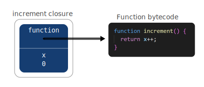
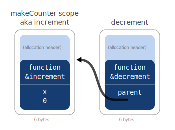
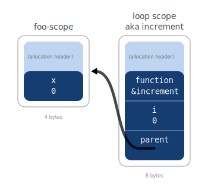
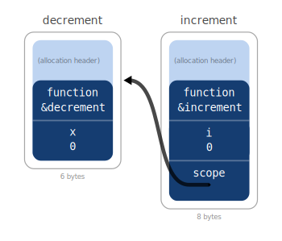
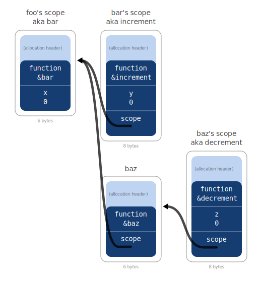

# Closure Embedding

## Introduction

For performance reasons, the runtime representation of closures is quite different from the source language representation of closures:

  1. In the source language (JavaScript), a closure is essentially a tuple (pair) of the function source text and the declaring environment.
  2. In the engine (at runtime or compile time), a closure is an arbitrary-sized container whose first slot is a function pointer and the other slots represent variables. It is overloaded to represent both the closure and environment at the same time.

This runtime implementation [improves memory overhead significantly](https://github.com/coder-mike/microvium/issues/38) by unifying closures and environments into a single allocation.

For example:

```js
function makeCounter() {
  let x = 0;

  function increment() {
    return x++;
  }

  return increment;
}
```

In the traditional model, `increment` is a closure, which is a tuple that points to both the `increment` source text and the environment of the particular `makeCounter` call. However, in the Microvium runtime model, these two can be merged together into a single heap allocation with both the function pointer and the state of `x`, taking just 2 slots in this case (6-bytes including the function header).



Note: the above diagram elides the function header for simplicity.

The process of inlining a closure allocation into its surrounding environment is here called _closure embedding_ (I've made up this term).

The complicated part, which is why I'm writing this document, is that the runtime engine _always_ uses this embedded style of closure, but the conversion from the traditional style to the embedded style is not always straight forward.

## Waterfall indexing

As [discussed elsewhere](https://coder-mike.com/blog/2022/04/18/microvium-closure-variable-indexing/), runtime closures use _waterfall indexing_ (also a term I made up). This means that if you index a variable past the end of the closure, it will overflow to the parent closure. The _last_ slot in the closure is special because when a closure index overflows, the last slot is assumed to point to the parent closure.

## Only one closure per scope can be embedded

Consider the following:

```js
function makeCounter() {
  let x = 0;
  const increment = () => ++x;
  const decrement = () => --x;
  return [increment, decrement]
}
```

Note that both `increment` and `decrement` are distinct closures but share the same `x`.

Although we can reserve 2 slots in the parent scope for the `increment` and `decrement` function pointers, only the first slot in an embedded closure is the special callable slot. So we can't make a closure that is both `increment` and `decrement` and stores `x`.

So we can only choose to embed one of the nested functions. The question then becomes what to do with the other?

## Fallback for non-embedded closures

Although the runtime engine doesn't support non-embedded closures as such, we can emulate non-embedded closures by having an "empty" embedded closure with no variables of its own. The first slot of this "empty" closure will point to the function code, while the second slot points to the "actual" environment of the closure.

Note: I say "empty" here to mean that the closure has no embedded variables of its own.

In terms of RAM usage, this is basically the same as the original closure model I was using, where closures are tuples. Here, an empty closure acts like a tuple because it has 2 slots. But the indexing is a bit different to the original model so it's still worth explaining in more detail.

In the above example with `increment` and `decrement`, we might embed `increment` into its parent scope (alongside `x`) while keeping `decrement` as an independent allocation by using this "empty closure" model. Note in the following diagram that the closure on the right has no variables of its own but instead references the `increment` closure as its parent.



Note in the diagram above that the closure on the left is labeled as both the "makeCounter scope" and the "increment closure" because the two are synonymous as they are unified in a single allocation.

The rule currently used is that the first embeddable closure will be the one that is embedded, which is reflected in the diagram by the fact that `increment` is embedded but not `decrement`.

In this example, both `increment` and `decrement` have access to the variable `x`, but `decrement` does so indirectly through its own empty closure. When the `increment` function accesses variable `x`, it will do it by `LoadScoped(1)` - i.e. `x` is the second slot in the `increment` closure record. But when `decrement` accesses variable `x`, it will do so by `LoadScoped(3)`:

  - `LoadScoped(0)` would access its own closure function pointer `&decrement`. This ability to access its own function pointer is critical to the design of async/await which I won't go into detail here.

  - `LoadScoped(1)` would access its own closure parent pointer, here called `scope`. The ability to manipulate its own parent pointer is also useful for the design of async-await because it allows us to reuse this slot for other purposes when we no longer require a pointer to the parent scope.

  - `LoadScoped(2)` "overflows" the `decrement` closure and accesses the first slot of the `increment` closure.

  - `LoadScoped(3)` similarly overflows and accesses the second slot of the `increment` closure, which is `x`.

The general rule here is that if a closure is not embedded, then the static analysis needs to add `+2` to the variable index when accessing the parent scope. This may happen recursively since we could have nested levels of non-embedded closures.

## Different scope lifetimes

Consider the following:

```js
function foo() {
  let x = 0;
  for (let i = 0; i < 10; i++) {
    const increment = () => ++x;
  }
}
```

This instantiates 10 closures which all reference `x`. Although there is syntactically only one declaration, it's dynamically multiple closures and so they can't all be physically embedded into the same parent environment record for the same reason as earlier.

Even if the loop only iterated once, the choice taken in Microvium is that a loop scope breaks the embedding chain, so `increment` here would not be embedded in the environment record containing `x`.

The generalization of this in the static analysis is a property of a scope called `sameInstanceCountAsParent`. This is set to `true` to indicate that for every instance of the parent scope, there will be at most one instance of the contained scope. Loop scopes and nested function scopes have the potential to be multiply-instantiated relative to their containing scope and so a nested closure within these scopes can't be embedded into the parent.

The rule that Microvium follows is that a closure will be embedded into the outermost parent scope that has the same instance count as the declaration.

Note that this actually means that the `increment` function will indeed be embedded, but it will be embedded into the _loop scope_ (the lexical scope of the body of the loop in the example) rather than the `foo` scope. The loop scope in this example would not normally be a closure scope because it doesn't hold any variables that are used by any closures, but this rule turns it into a closure scope with a single embedded function.

If we modify the function slightly to capture a copy of the variable `i` as well, then this embedding relationship becomes clearer.

```js
function foo() {
  let x = 0;
  for (let i = 0; i < 10; i++) {
    const i2 = i;
    const increment = () => i2 + (++x); // <-- using `i` as well
  }
}
```



In the diagram, only one of the 10 instances of `increment` are shown. Each instance of `increment` has a distinct identity, and each has its own instance of `i2` for the corresponding loop iteration.

Note: there's a subtle difference between capturing `i` vs `i2`, since `i` is in a scope that is cloned on each iteration but `i2` is in a scope that is fresh on each iteration. Although the program behavior will be the same, the structure of closures is different.

Note that `foo-scope` is the scope of the body of `foo`, not the `foo` function itself.

Here, `foo-scope` only has 1 slot (for the variable `x`). It doesn't require a `scope` pointer slot because no code under `foo` accesses anything in foo's outer environment. It also doesn't require a function pointer because it doesn't embed any closures.

In the following example, we can see what happens if we modified the example to embed a closure into `foo-scope`.

```js
function foo() {
  let x = 0;
  for (let i = 0; i < 10; i++) {
    const i2 = i;
    const increment = () => i2 + (++x);
  }
  if (condition) {
    const decrement = () => --x; // <-- this closure will be embedded
  }
}
```



Note that I deliberately complicated things in the above example by putting `decrement` under an `if (condition)`. Although this looks structurally similar to the loop, Microvium still treats this as `sameInstanceCountAsParent` because it's impossible to have multiple instances of `decrement` per environment record of `foo`. Calling this the "same instance count" is not strictly correct because there might also be no instances of `decrement` if `condition` is false, but this is irrelevant from the perspective of the static analysis for embedding.

Note that unlike the first example, `decrement` is the one embedded here, not `increment`, since decrement shares the same instance count with `foo-scope`.

Note that the diagram is essentially looking at the state after the function has run and both `increment` and `decrement` have been created. But of course there are intermediate states here while things are being initialized. For example, before `decrement` is assigned, the `decrement` variable (on the stack, because it's not used by a closure) will hold the value `VM_VALUE_DELETED` to indicate TDZ, and also the `function` slot in the `decrement` closure need not be initialized yet because `foo-scope` is not yet used as a closure.

To put this another way, `foo-scope` is simply a closure scope, but it has a reserved slot available so that we can upgrade it to also become the `decrement` closure if/when needed. If `condition` is false, then it will never be needed and that slot will remain unset.

## Closure nesting

```js
function foo() {
  let x = 0;

  function bar() {
    let y = 0;
    const increment = () => (++x) + (++y);
  }

  function baz() {
    let z = 0;
    const decrement = () => (--x) + (--z);
  }
}
```

In this example, `bar` is a closure because something inside it accesses `x`, and `increment` is a closure nested inside `bar`. Similarly `baz` is a closure with a nested `decrement` function.

Like before, `bar` will be embedded into `foo`'s scope because it is the first closure in `foo` with the same lifetime as the body of `foo`. And `baz` will not be embedded into `foo` because only one function can be embedded (in the following diagram, note the extra allocation required by `baz` which is not required by `bar`).

Both `increment` and `decrement` can be embedded, into `bar`'s and `baz`'s body scopes respectively.



As before, I've labeled each allocation both according to the scope (environment record) it represents and the closure it represents (i.e. the closure embedded into the environment record).

Note in particular that `baz` does not contain `z`. There is a distinction between `baz` and `baz's scope`. The heap allocation `baz` is an "empty closure" that exists because we couldn't embed `baz` into `foo's scope`. Each time we call `baz`, there will be another instance of `baz's scope` (only one is shown in the diagram). `baz's scope` contains the variable `z`, of course, but here it also contains the function pointer to the code/instructions for `decrement`, since the `decrement` closure is embedded into `baz's scope`.

In this example:

  - If `bar` wants to access `x`, it will use the index `4` (e.g. `LoadScoped(4)` or `StoreScoped(4)`). We come to this by counting the variables in bar's scope and overflowing to count the variables in foo's scope.
  - If `increment` wants to access `x`, it will also use index `4` because it's embedded into bar's scope.
  - If `baz` wants to access `x`, it will use index `6` - counting baz's scope and then overflowing to baz and then overflowing to foo's scope.
  - If `decrement` wants to access `x`, it will use index `6` as well because it's embedded into the same scope as any code in `baz`.

# Characteristics

The original design of closures did not include closure embedding. Introducing closure embedding has the following effects on Microvium:

  - A closure now commonly only takes 4 bytes of additional memory over and above the variable slots, down from 10 bytes previously. It's also one less allocation which eases GC pressure slightly.

  - When closures can't be embedded, they fall back to using just the additional 6 bytes of memory, which is the same as the previous design.

  - Closures are no longer immutable. At the IL level, they can be self-modifying. This will be useful for async/await, when I get there.

  - On the downside, the static analysis is more complicated, and the unification of closures and environment records may be confusing to some.


