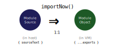

# Microvium Module API

At a glance, microvium has the following API related to the module system (this documentation is abbreviated.

See also the full interface in [./lib.ts](../../lib.ts)). <br>
See also https://coder-mike.com/2020/04/microvium-modules

```ts
interface Microvium {
  /** Create a new, empty microvium virtual machine */
  static create(): Microvium;

  /**
   * Imports the given source text as a module.
   *
   * Returns the module namespace object for the imported module: an object
   * whose properties are the exports of the imported module.
   *
   * A call to `importNow` with the exact same `ModuleSource` will return the
   * exact same `ModuleObject` (by reference equality).
   */
  importNow(moduleSource: ModuleSource): ModuleObject;

  /** Writable access to global variables through a proxy object */
  readonly globalThis;
}
```

`ModuleSource` and `ModuleObject` are defined as follows:

```ts
/**
 * Represents the information needed to import a module from source text.
 */
interface ModuleSource {
  /** Microvium source text for the module */
  readonly sourceText: string;

  /** If specified, the debugFilename will appear in stack traces and facilitate
  * breakpoints in the source text. */
  readonly debugFilename?: string;

  /** If specified, this allows the module to have its own nested imports */
  readonly importDependency?: ImportHook;
}

type ImportHook = (specifier: ModuleSpecifier) => ModuleObject | undefined;

type ModuleSpecifier = string; // The string passed to `import`
```

## importNow

```ts
importNow(moduleSource: ModuleSource): ModuleObject;
```

This method takes an object representing the source text and returns an object whose properties are the exports of the imported module.



### Examples

```ts
vm.importNow({ sourceText: `print('Hello, World!')` });

const { x } = vm.importNow({ sourceText: `export const x = 5;` });
```

## importDependency: ImportHook

This is a callback to the host, on a per-module basis, that must return a module object given a module specifier. It should encapsulate all the


Example: https://coder-mike.com/2020/04/microvium-modules#import-dependency

## Typical Use, with `nodeStyleImporter`

In typical use, the `ImportHook` will not be implemented by hand. The microvium library offers a `nodeStyleImporter` which should work for most microvium hosts implemented in node.js:

```ts
function nodeStyleImporter(vm, options): ImportHook;
```

And example usage is as follows:

```ts
import Microvium from 'microvium';

const moduleOptions: ModuleOptions = {
  // Allow the importer to access the file system
  accessFromFileSystem: 'subdir-only',

  // Specify the root directory of the project, from which initial imports will be resolved
  basedir: 'my/project/directory',

  // A set of "core" modules: those which can be imported from any microvium module with the exact same specifier.
  coreModules: {
    'a-core-module': './a-core-module.mvms',
    'another-core-module': require('a-module-in-the-host')
  },

  // Allow microvium modules to import `fs`, `http`, etc.
  allowNodeCoreModules: true,
};

const vm = Microvium.create();
const importer = nodeStyleImporter(vm, moduleOptions);
importer('./the-entry-module');
```

