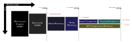

# Memory Usage (of microvium.c)

Note: These sizes are measured in May 2022 and are subject to change (or may have already changed when you read this).

TL;DR:

  - The engine itself uses **8-16kB of ROM** and no statically-allocated RAM.
  - Each virtual machine uses at least:
    - **32 bytes** of ROM
    - **34 bytes** of RAM while idle
    - About **300 B of RAM** while called (if using the default stack size of 256B)
    - Plus script-specific variables and data, up to 64kB, allocated as-needed by the VM.
  - Variable slots are 2 bytes each

See also:

  - [size-tests.md](../../size-test/size-tests.md)
  - [memory-management.md](./memory-management.md)

The memory usage of a Microvium program changes over time as the program is running. A typical memory profile on a microcontroller may be as follows:

The minimum possible space required (to run an empty script) is as follows:

  - **Microvium engine** (in flash): `8 to 16 kB`
  - **Bytecode** (in flash): `32 B`
  - **Idle memory** (in RAM): `34 B`
  - **GC heap memory** (in RAM): `0 B` (if there are no heap allocations)
  - **Stack and register memory** (in RAM): `0 B` while VM is inactive; `20 B` + [stack size configured in port file] while VM is active.

The above sizes are for Microvium running on a 32-bit architecture. For an 8 or 16-bit architecture, the sizes will be smaller.

## Bytecode

The bytecode representation of the snapshot of a virtual machine can be downloaded or compiled into ROM. The bytecode has a fixed-size header in the order of 32 bytes, and its final size depends on the amount of code and data in the snapshot.

The bytecode file contains regions for:

  1. Compiled functions as bytecode instructions
  2. A copy of the data memory corresponding to when the snapshot was captured
  3. A copy of the heap memory corresponding to when the snapshot was captured
  4. Metadata recording the imports and exports of the VM, engine requirements, etc.

## Idle Memory

The working memory of the VM is `malloc`'d from the host when the VM is restored from the snapshot at runtime. The `malloc`'d space includes space for:

  1. Global variables for the VM script (2 bytes per variable)
  2. Internal structures required by the engine to host a virtual machine (about 34 bytes of memory, depending on the architecture).

The initial values of the global variables are copied from the bytecode image when the VM is restored.

## GC Heap Memory

The VM heap includes objects which are eligible for garbage collection. The size of the heap may change over time and is allocated from the host in chunks (e.g. of 256 B each) as needed by the VM.

VM values existing in the heap have a 2-byte header and are rounded up in size to the nearest 2-byte boundary.

Reachable values in the heap effectively double their RAM footprint for a brief time during a GC collection cycle, as they copied into a new heap. If you are running Microvium on top of a moderately sized C firmware, it's best to schedule GC collections for periods of low heap activity.

There is no minimum heap memory size. If there are no object allocated in the heap, the region for the heap will not be allocated from the host at all.

## Stack and Registers

When the host needs to call into the VM, the VM will allocate temporary space for the stack and running registers (e.g. program counter, stack pointer, etc). The stack size is fixed but configurable for each host by the [port file](https://github.com/coder-mike/microvium/blob/master/native-vm/microvium_port_example.h) (defaulting to 256 B).

Each stack frame is a minimum of 8 bytes, plus space for local variables, arguments, and temporary values. Each local variable is 2 bytes on the stack.

The stack and working registers are freed while the VM is idle (i.e. when a script function returns back to the host).

# Size used by different value types

Basic values use 2 bytes each:

  1. Integers in the range `-8192` to `8191` (14-bit signed range)
  2. Boolean values `true` and `false`
  3. `undefined`, `null`, `NaN` and an empty string

Other values are represented internally as a 2-byte pointer into the heap, and consume the following memory:

  - **Strings:** UTF-8 encoded string, `+1B` extra null terminator, `+2B` allocation header, `+2B` pointer to refer to it from a variable.

    - Chars in Microvium are single-character strings, and so consume `6B` of space each.

  - **Int32:** Integers exceeding the 14-bit range will be stored as 32-bit integers on the VM heap, `+2B` allocation header, `+2B` pointer to refer to it from a variable (total of `8B`)

