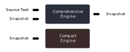

# MicroVM

A compact scripting engine for executing small programs written in a subset of JavaScript.

(The name "MicroVM" is tentative)

## Install

```sh
npm install
npm build
```

## Usage

Nothing to use yet.

This is how it's planned to work:

MicroVM consists of two engines:

 1. A *compact* engine to run script code on a microcontroller
 2. A *comprehensive* engine to run script desktop

These two engines come with different tradeoffs and a typical workflow will use both engines:

### Compact Engine

This engine is implemented in portable C code, designed to be compiled into a larger native project such as firmware on a microcontroller.

Features and limitations of the compact engine:

 - Designed for performance and memory efficiency
 - The engine implementation is small
 - Only supports address spaces up to 16kB (a virtual machine cannot allocate more than 16kB of RAM or ROM)
 - The state of a VM running on the compact engine cannot be snapshotted to a file
 - The engine can load an existing snapshot (saved by the *comprehensive engine*)
 - Cannot load modules or parse source text

### Comprehensive Engine

The Comprehensive Engine is designed to run on a desktop-class machine, such as a build machine or server environment. The main features of the Comprehensive Engine over the Compact Engine are:

 1. The ability to parse source text and import modules
 2. The ability to capture snapshots to file. These snapshots can then later be resumed on the compact engine (or another comprehensive engine).



Other things that make Comprehensive Engine different from the Compact Engine:

 - Implemented in JavaScript and designed to run on node.js, not an embedded device.
 - The host can give the VM access to desktop-specific APIs, such as the file system and databases.

A typical workflow will use the Comprehensive Engine to execute the source text as far as is required to import dependencies and perform initialization, and then download a snapshot of this VM to the target MCU device to be resumed on the compact VM.

A snapshot is a compact binary representation of the state (code and data) of a virtual machine at a single point in time.

## Run Tests

```sh
npm test
```
If you make changes to the code, some output files can be manually inspected and then running the following will update the expected output with the actual output (see `./scripts/pass.ts`):

```
npm run pass
```

Note: if you add a debug watch to evaluate `TraceFile.flushAll`, then the `TraceFile` outputs will all be up to date every time you breakpoint.

## Contributing

A suggested pre-commit git hook is as follows:

```sh
#!/bin/sh
set -e
npm run check-for-wip
npm test
```

Then if you have anything you need to remember to change before committing, put a `// WIP` comment on it, and the hook will catch it if you accidentally forget about it.