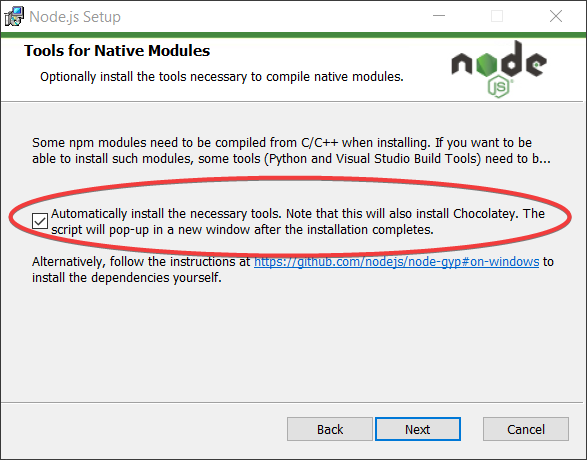

# MicroVM

A compact scripting engine for MicroControllers for executing small scripts written in a subset of JavaScript.

(The name "MicroVM" is tentative)

**Note: THIS PROJECT IS STILL IN EARLY STAGES OF DEVELOPMENT**

## Features

  - Run the same script code on small microcontrollers and desktop-class machines (ideal for IoT applications with shared logic between device and server)
  - Persist the state of a virtual machine to a database or file**
  - Run the scripts on your custom host API for your particular application
  - Lightweight and portable MCU implementation
  - Easy to use

**There is a separate implementation of the virtual machine for microcontrollers vs desktop-class machines, which support different features. Check out the [Concepts](./doc/concepts.md) page for more detail.

## Get Started

If you're new to MicroVM, check out the [Getting Started](./doc/getting-started.md) tutorial which explains the concepts and how to get set up.

## Docs

  - [Getting Started](./docs/getting-started.md)
  - [Concepts](./docs/concepts.md)
  - [Contribute](./docs/contribute.md)

## Using in a C Project

  1. Copy the source files from the [native-vm directory](https://github.com/coder-mike/micro-vm/tree/master/native-vm) into your C project, ideally in their own subfolder.

  2. Create a `vm_port.h` file to specify platform

  3. TODO

## Using in on a Desktop or Server with Node.js

Requires [Node.js](https://nodejs.org/en/download/) to be installed, with the tools for building native modules ([see note below](#Requires-Tools-for-Native-Modules)).

```sh
npm install microvm
```

### Hello World

```js
// app.js
import { MicroVM } from 'microvm';

// Create a new VM with access to a 'print' global variable
const vm = MicroVM.create({
  print: s => console.log(s)
});

vm.importSourceText('print("Hello, World!");'); // Prints "Hello, World!" to the console
```

### Requires Tools for Native Modules

Note: this project requires that node was installed with the optional extensions for building C++ packages. [https://napi.inspiredware.com/getting-started/tools.html](https://napi.inspiredware.com/getting-started/tools.html). On Windows, this can be done by checking the corresponding box at installation:




## Run Tests

```sh
npm test
```
If you make changes to the code, some output files can be manually inspected and then running the following will update the expected output with the actual output (see `./scripts/pass.ts`):

```
npm run pass
```

## Contributing

Check out [./doc/contribute.md](./doc/contribute.md).